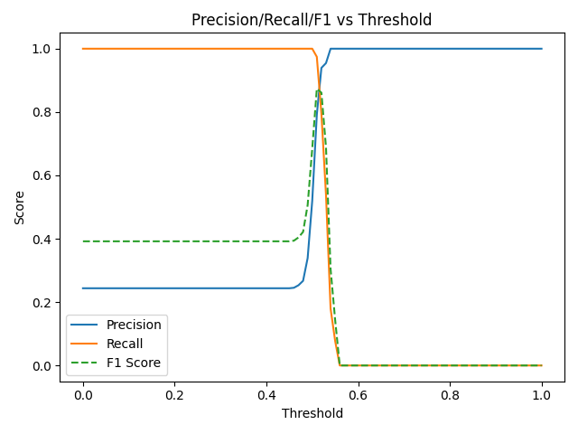

# 🧠 Logistic Regression Scratch — Experiment Report

## 📘 Experiment Setup

**Goal:**  
Implement and analyze binary Logistic Regression from scratch using only NumPy.  
This experiment explores threshold tuning, regularization strength, and learning rate impact.

**Dataset:**  
- Synthetic 2D Gaussian blobs  
- 600 samples from class 0  
- 200 samples from class 1  
- 80/20 train-test split  
- Slight class imbalance (75/25)

**Training Parameters:**
- Learning rate: `0.1`
- Epochs: `5000`
- Regularization (λ): `0.01`
- Early stopping tolerance: `1e-7`
- Optimizer: Batch Gradient Descent

---

## 📊 Precision–Recall–F1 vs Threshold

Below is the result of evaluating precision, recall, and F1 score as we vary the classification threshold.

### 🧩 Interpretation

1. **Recall (orange) starts near 1.0**  
   At very low thresholds, the model predicts almost all points as positive.  
   → High recall (captures all positives), but many false positives → low precision.

2. **Precision (blue) rises as threshold increases**  
   As the threshold moves above ~0.4, the model becomes more selective.  
   → Fewer positives predicted, but more accurate ones.

3. **F1 score (green dashed)** peaks around the point where precision and recall balance.  
   → This is the optimal classification threshold.

4. **Extremes:**  
   - At very low thresholds, model predicts everything positive.  
   - At high thresholds (>0.6), model rarely predicts positive (recall → 0).

**From console output:**
